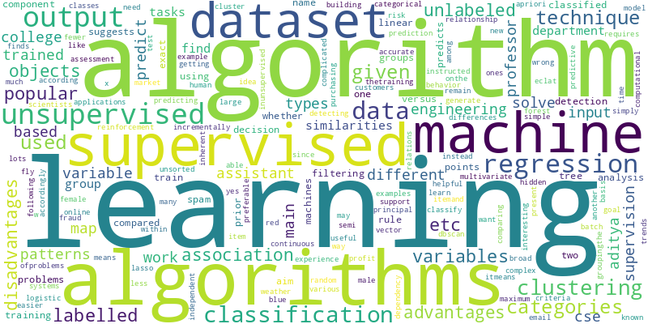
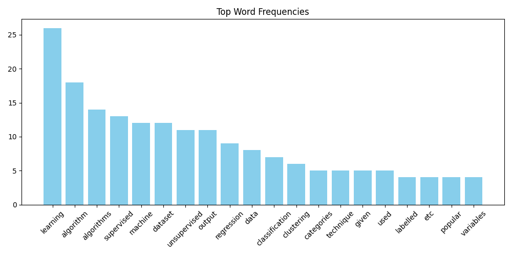

# 📄 Doc_Analyzer (PDF Text & NLP Analyzer in Python)

DocAnalyzer is a command-line tool built with Python that:
-  Extracts full text from PDF files
-  Identifies and highlights **named entities** (like names, dates, places)
-  Analyzes and visualizes **word frequency**
-  Generates a **word cloud**
-  Creates important sentences **summary**
-  Saves output in organized files and images

>  This is a self-directed NLP + automation project designed for offline usage, perfect for researchers and students.

---

# Built With

    pdfplumber

    nltk

    spaCy

    matplotlib

    wordcloud

---

##  Demo

| Word Cloud Example | Word Frequency Plot |
|--------------------|---------------------|
|  |  |

---

##  Sample Input

We used a publicly available sample AI-related PDF (`sample.pdf`) which contains natural language and technical content. You can replace it with any other document.

---

##  Output Files

All results are saved in the `output/` folder:

| File | Description |
|------|-------------|
| `full_text.txt` |  Complete text extracted from the PDF |
| `summary.txt` |  Top  most relevant sentences |
| `wordcloud.png` |  Word cloud of frequent words |
| `frequency_plot.png` |  Bar chart of top word frequencies |


Make sure `sample.pdf` is placed in the **project root directory**, like this:

# Files Arrangements

```
DocAnalyzer/
├── pdf_analyzer.py
├── sample.pdf 
├── requirements.txt
├── README.md
├── output/
│ ├── full_text.txt
│ ├── summary.txt
│ ├── frequency_plot.png
│ └── wordcloud.png
└── venv/

```

# Setup (First Time)

## Clone the repository
```
git clone https://github.com/Waleed99i/DocAnalyzer.git
cd DocAnalyzer
```
## Create virtual environment
```
python3 -m venv venv
source venv/bin/activate
```
## Install dependencies
```
pip install -r requirements.txt
```


## Download NLTK + spaCy models
```
python -m nltk.downloader punkt stopwords
python -m spacy download en_core_web_sm
```

#  How to Run


## Step 1: Activate virtual environment
```
source venv/bin/activate
```
## Step 2: Run the analyzer
```
python pdf_analyzer.py
```
----


# Author

### Muhammad Waleed Akram
##### Electrical Engineering Student | AI + Systems Enthusiast
Checkout my [Linkedin](https://www.linkedin.com/in/waleed-akram-362b66282/) profile

# License

This project is free to use under the MIT License.


